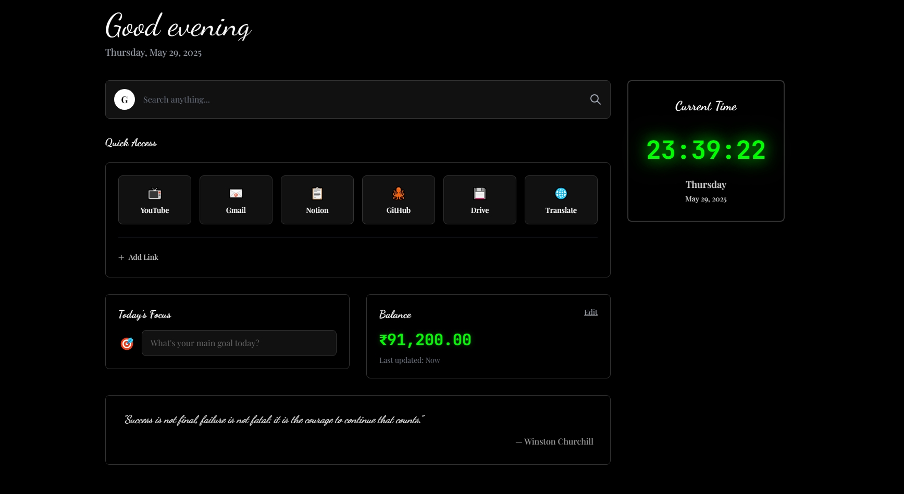

# 🧠 Professional Default Chrome Page

A sleek, modern personal dashboard built with **HTML**, **Tailwind CSS**, and **JavaScript**. This customizable homepage combines productivity and elegance, offering quick access to essential tools and motivation at a glance.

---

## 🚀 Features

### 🕒 Digital Clock & Date
- Displays a live, real-time clock and formatted date.
- Automatically updates every second for precision.

### 💬 Dynamic Greeting
- Greets you based on the time of day:
  - **Good Morning**
  - **Good Afternoon**
  - **Good Evening**

### 💡 Inspirational Quotes
- Rotates through a selection of motivational quotes every 10 seconds.
- Keeps you inspired throughout the day.

### 🎯 Daily Focus
- Enter your **main goal** or **focus** for the day.
- Stored locally using `localStorage` to persist across sessions.

### 💰 Bank Balance
- View and update your personal balance.
- Quick-edit with instant save to `localStorage`.

### 🔗 Quick Access Links
- Preloaded with useful links (YouTube, Gmail, Notion, etc.).
- Add your own custom links with icons or emojis.
- Remove links with a simple **right-click**.
- Fully persisted in the browser using `localStorage`.

---

## 📸 Screenshot

> _Add your screenshot here:_
> 

---

## 🛠️ Built With

- **HTML5** – Semantic markup
- **Tailwind CSS** – Utility-first styling framework
- **JavaScript (ES6)** – Logic and interactivity
- **Google Fonts** – `Playfair Display`, `Dancing Script`, `JetBrains Mono`

---

## 🧪 Getting Started

### 📂 Open Locally
1. Clone or download this repository.
2. Open `index.html` in your browser.

### 🔌 With Live Server (VS Code)
1. Install the **Live Server** extension.
2. Right-click on `index.html` > **Open with Live Server**.

---

## 💾 Data Persistence

All data is stored in the browser's `localStorage`:
- `dashboard_quick_links`
- `dashboard_today_goal`
- `dashboard_bank_balance`

You can clear these manually via **DevTools** > **Application** > **Local Storage** to reset the dashboard.

---

## 🧰 Customization

- Modify default links in the `defaultQuickLinks` array.
- Add more motivational quotes in the `quotes` array.
- Change theme, layout, and typography via Tailwind utility classes.

---

## 📄 License

This project is open-source and available under the **MIT License**.

---

## 🙌 Acknowledgements

- [Tailwind CSS](https://tailwindcss.com)
- [Google Fonts](https://fonts.google.com)
- Inspired by modern productivity tools and personal dashboards.

---
